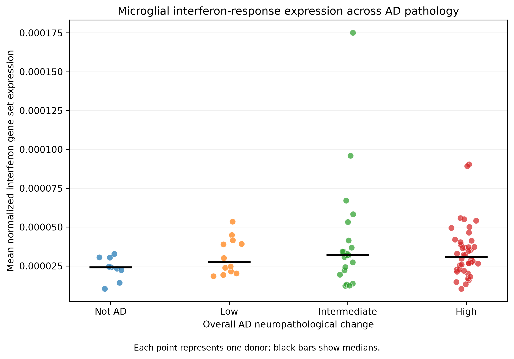
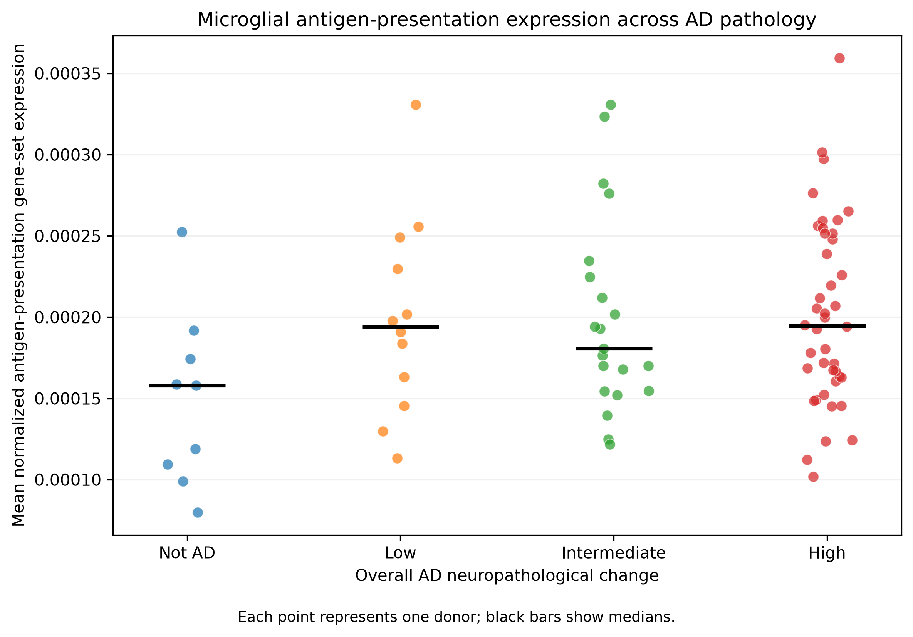

# Microglial Immune Activation Across Alzheimer's Disease Pathology

## Background

Microglia participate in immune surveillance and inflammatory responses in the central nervous system. This independent educational project reanalyzes publicly available single-nucleus RNA-sequencing data to examine whether two prespecified microglial immune programs vary across Alzheimer's disease (AD) neuropathology.

## Research question

Do donor-level microglial interferon-response and antigen-presentation programs differ across Alzheimer's disease neuropathologic severity in the SEA-AD middle temporal gyrus cohort?

## Dataset

- Seattle Alzheimer's Disease Brain Cell Atlas (SEA-AD)
- Data accessed through the CZ CELLxGENE Discover Census release `2025-11-08`
- CELLxGENE dataset ID: `c76098ba-eed3-45b1-98f2-96fcac55ed18`
- Brain region: middle temporal gyrus
- Cell population: microglial nuclei
- Expression source: CELLxGENE Census normalized layer
- Neuropathology annotations: official SEA-AD cohort donor metadata, joined to CELLxGENE data by donor ID

## Cohort and sample

The initial CELLxGENE subset contained 40,000 microglial nuclei from 89 donors. Five donors lacked matching official neuropathology metadata, leaving 38,905 nuclei from 84 donors for the pathology analysis.

| Analysis group | Neuropathology categories | Donors |
| --- | --- | ---: |
| Lower pathology | Not AD (9) and Low (12) | 21 |
| Higher pathology | Intermediate (21) and High (42) | 63 |

## Analysis overview

All 20 prespecified genes were available in CELLxGENE Census. For each nucleus, a program score was calculated as the mean normalized expression of the genes in that program. Scores were then averaged to the donor level. Each final observation represents one donor; nuclei were not treated as independent human samples.

The primary comparison grouped Not AD and Low as lower pathology and Intermediate and High as higher pathology, using a two-sided Mann-Whitney U test and Cliff's delta. An ordinal analysis used Spearman correlation with neuropathology coded as Not AD = 0, Low = 1, Intermediate = 2, and High = 3. A sensitivity analysis used donor-level ordinary least squares models adjusted for age at death and sex, with HC3 robust standard errors. Additional stability checks adjusted for donor-level multiome fraction and repeated the analyses among donors with at least 200 nuclei; the 200-nucleus threshold is pragmatic rather than a validated quality-control cutoff.

## Gene programs

**Interferon response:** `IFI6`, `IFI27`, `IFI44`, `IFI44L`, `IFIT1`, `IFIT2`, `IFIT3`, `ISG15`, `MX1`, `OAS1`, `OAS2`, `STAT1`

**Antigen presentation:** `HLA-DRA`, `HLA-DRB1`, `HLA-DPA1`, `HLA-DPB1`, `HLA-DQA1`, `HLA-DQB1`, `CD74`, `CIITA`

## Main results

| Analysis | Interferon response | Antigen presentation |
| --- | ---: | ---: |
| Lower-pathology mean | 0.000028 | 0.000178 |
| Higher-pathology mean | 0.000037 | 0.000201 |
| Mann-Whitney U | 520 | 509 |
| Primary-comparison p-value | 0.1452 | 0.1164 |
| Cliff's delta | -0.2139 | -0.2305 |
| Ordinal Spearman rho | 0.1455 | 0.1842 |
| Ordinal-correlation p-value | 0.1867 | 0.0935 |

Negative Cliff's delta values indicate a tendency toward higher scores in the higher-pathology group because the lower-pathology group was entered first.

In the adjusted sensitivity analysis, higher pathology was positively associated with the interferon-response score (coefficient = 8.956e-06, p = 0.031, 95% CI 8.2e-07 to 1.71e-05). The corresponding antigen-presentation association was not statistically significant (coefficient = 2.307e-05, p = 0.145, 95% CI -7.94e-06 to 5.41e-05).



*Interferon-response program scores across the four neuropathology levels. Each point represents one donor.*



*Antigen-presentation program scores across the four neuropathology levels. Each point represents one donor.*

## Interpretation

Higher-pathology donors showed modestly higher donor-level scores on average, but the primary lower-versus-higher comparisons and ordinal correlations were not statistically significant. The adjusted interferon-response result was not supported by the primary nonparametric analyses, and the model residuals were strongly skewed. It should therefore be treated as a sensitivity-analysis finding rather than definitive evidence. Overall, these exploratory results do not establish a causal association or a novel AD mechanism.

## Limitations

- This is an independent educational reanalysis of publicly available data.
- The analysis is observational and cross-sectional and cannot support causal conclusions.
- Program scores are simple averages of prespecified genes, not validated biomarkers.
- Pathology group sizes are unequal (21 lower pathology and 63 higher pathology).
- Five CELLxGENE donors lacked matching pathology metadata and were excluded.
- Potential technical and biological covariates were not modeled exhaustively.
- The adjusted interferon-response finding requires caution because it was not supported by the primary nonparametric analyses and the model residuals were strongly skewed.

## Repository structure

```text
figures/       Final immune-program visualizations
notebooks/     SEA-AD analysis notebook and notebook documentation
references/    Dataset and documentation links
results/       Donor-level derived analysis table
analysis_plan.md
```

## Status and reproducibility

The educational analysis MVP is complete. The notebook retrieves the public data, constructs donor-level scores, runs the reported analyses, and saves the derived outputs. Results remain exploratory and have not undergone peer review.
